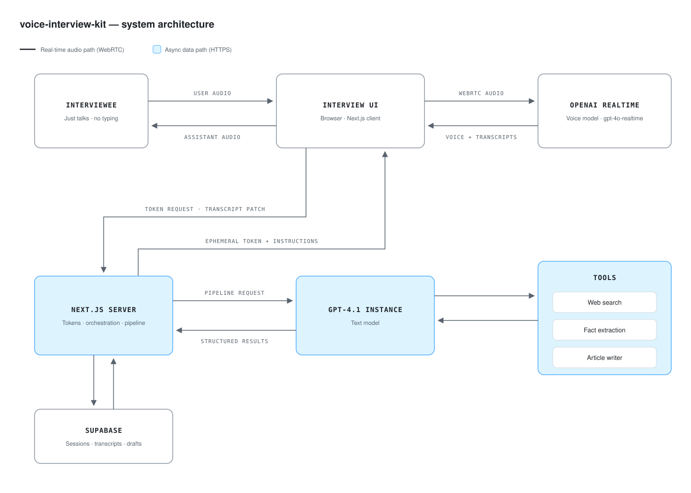

# voice-interview-kit

**A kit for building voice AI agents that interview people and turn the conversation into publishable content.**

One 15-minute voice interview produces roughly 1,500–2,500 words of first-party editorial — grounded in what the interviewee actually said, with images placed, and shaped into a payload your CMS can accept.

<picture>
  <source media="(prefers-color-scheme: dark)" srcset="docs/architecture-dark.svg">
  
</picture>

## Why interview instead of generate

Generic AI writing has a structural problem: it can only recombine what's already published. It cannot report. Google's helpful-content guidance rewards demonstrated first-hand experience — the E in E-E-A-T — and that is precisely the thing a language model cannot fabricate on its own.

So this doesn't generate content. It **interviews a human who has the experience**, then does the work of turning speech into structure.

The engineering follows from that premise:

- **Every extracted fact must cite a verbatim quote from the interviewee.** The extraction step maintains an evidence log; a claim with no supporting quote doesn't survive. This exists because without it, the extractor infers answers from the interviewer's *questions* — the bot asks "did you try the shuwa?" and the article confidently reports that you did.
- **Anything not discussed stays `null`.** Budget wasn't mentioned? The article skips budget. Nothing is estimated, inferred, or padded.
- **Research runs before the interview, not during.** The agent arrives already knowing what to ask about, so you get specifics instead of "so, tell me about your trip."

The output is content only that person could have produced. That's the point.

## What comes out

| Artifact | Detail |
|---|---|
| Article | ~1,500–2,500 words, first-person, from the interviewee's own account |
| Structured extraction | Typed facts with an evidence log tying each to a quote |
| Images | Uploaded photos curated by a separate pipeline — featured image selected, placements chosen against article structure |
| CMS payload | Title, slug, HTML, excerpt, tags, categories, meta — WordPress-shaped, connector-ready |
| Transcript | Raw entries plus a cleaned, readable version |

## How it works

1. **Intake** — the subject fills a short form defining who they are and what the interview is about.
2. **Research** — GPT-4.1 with live web search builds an interview brief: what to probe, what the community argues about, what specifics to chase. The interview stays locked until the brief lands, so the agent is never asking generic questions.
3. **Voice interview** — the browser mints an ephemeral OpenAI Realtime token with the full agent prompt baked in, then streams audio peer-to-peer. **The server is never in the audio path** — no proxy latency, and transcripts survive a closed tab because they're patched as they arrive.
4. **Pipeline** — clean transcript → extract structured facts with evidence → generate the article → curate images → build the CMS payload → store, versioned.
5. **Review & publish** — review the draft, then push to your CMS.

Architecture detail and the reasoning behind each decision: [docs/ARCHITECTURE.md](docs/ARCHITECTURE.md). An interactive flow walkthrough ships at `/flow-diagram.html`.

## Building your own agent

The kit separates the **engine** (WebRTC session handling, orchestration, pipeline, persistence) from the **domain** ([`interview.config.ts`](interview.config.ts)), which declares your intake fields, interviewer persona, interview phases, extraction schema, outputs, and connectors.

**Travel Stories is the reference implementation** — interview employees about trips, get travel articles. It's fully working, and it's the worked example for the config surface.

### Status — what's wired

Being straight about this, because the config layer looks more finished than it is.

**Working:** the full pipeline end to end. Research, persona, extraction and article prompts all driven by config, as are the model, voice and transcription settings. The **intake form renders entirely from `config.intake.fields`** — including the repeating section, which disappears cleanly when a config doesn't declare one — and intake **persists to a generic `data` JSONB column**, so any config's fields survive without a schema change.

**Not yet wired:** `interview.phases`, `connectors` and `campaigns` are declared and typed but not read by the engine. Topic tracking still injects a hardcoded travel checklist into every system prompt, which means an interview about something else will still get asked about restaurants. `subject.profileFields` renders, but its field ids must match `author_profiles` columns to save.

**One known hole:** `author_profiles.work_email` is `UNIQUE NOT NULL` and the upsert keys on it, so author profiles still assume an email field exists.

**So adopting this for a different domain today means engine work, not just a new config file.** The parts already domain-agnostic and safe to build on: the [`InterviewContext`](src/lib/config/types.ts) contract, plus `extractor.ts`, `article-generator.ts`, `research-service.ts`, and the realtime token route. Progress and ordering in the [Roadmap](#roadmap).

## Tech stack

| Layer | Technology |
|-------|-----------|
| Framework | Next.js 16 (App Router) + TypeScript |
| Styling | Tailwind CSS v4 |
| Database | Supabase (PostgreSQL) |
| Voice | OpenAI Realtime API over WebRTC |
| Research + processing | OpenAI GPT-4.1 (Responses API with web search + Chat API) |
| Images | sharp + Supabase Storage |
| Hosting | Vercel, or anywhere Next.js runs |

## Setup

Two ways in. **Path A needs no terminal and no code** — you'll click through three websites and paste one block of SQL. You do still need an OpenAI account with billing and a Supabase account, so it isn't quite zero-effort, but nothing here requires knowing how to code.

### Before you start — two things to know

> **There is no login.** Anyone who has a URL from your deployment can see every interview on it, and the app doesn't ask who they are. That's fine for trying this out with your own test interviews. **Don't collect real people's names, emails and recorded conversations until you've added authentication.**

> **It costs roughly $1 per 15-minute interview** — the voice session plus the research call and five processing steps. There's no spend cap in the code. Add a payment method to OpenAI *before* you deploy: with no credit, the research step fails and the interview never unlocks.

### Path A — deploy without a terminal

**1. Create a Supabase project** at [supabase.com](https://supabase.com). Pick a region near you. Wait for it to finish provisioning.

**2. Create the database tables.** In your project: **SQL Editor** → **New query** → paste the entire contents of [`supabase/schema.sql`](supabase/schema.sql) → **Run**. It's safe to run twice if something goes wrong.

**3. Create the image bucket.** **Storage** → **New bucket** → name it exactly `trip-images` → turn **Public** on → Create.

> Don't skip this. The bucket name is hardcoded, nothing creates it for you, and if it's missing photo uploads fail with an unhelpful error that doesn't mention buckets.

**4. Get an OpenAI key** at [platform.openai.com/api-keys](https://platform.openai.com/api-keys). Confirm billing is set up under **Settings → Billing**.

**5. Deploy.**

[](https://vercel.com/new/clone?repository-url=https%3A%2F%2Fgithub.com%2Fsidass26%2Fvoice-interview-kit&env=NEXT_PUBLIC_SUPABASE_URL,NEXT_PUBLIC_SUPABASE_ANON_KEY,SUPABASE_SERVICE_ROLE_KEY,OPENAI_API_KEY&envDescription=Three%20values%20from%20Supabase%20%28Project%20Settings%20%E2%86%92%20API%29%20and%20one%20OpenAI%20API%20key&envLink=https%3A%2F%2Fgithub.com%2Fsidass26%2Fvoice-interview-kit%23setup)

Vercel will ask for four values. The first three are in Supabase under **Project Settings → API**:

| Paste this | Find it here |
|---|---|
| `NEXT_PUBLIC_SUPABASE_URL` | Supabase → Project Settings → API → **Project URL** |
| `NEXT_PUBLIC_SUPABASE_ANON_KEY` | Supabase → Project Settings → API → **anon public** |
| `SUPABASE_SERVICE_ROLE_KEY` | Supabase → Project Settings → API → **service_role** (keep this secret) |
| `OPENAI_API_KEY` | The key from step 4 |

**6. Check it worked.** Open your new Vercel URL **in Chrome**, start an interview, and fill in the first step. Then look in Supabase → **Table Editor** → `intake_responses`. A row should be there.

### Path B — run it locally

```bash
git clone https://github.com/sidass26/voice-interview-kit.git
cd voice-interview-kit
npm install
cp .env.example .env.local
```

Do steps 1–4 above, put the same four values in `.env.local`, then:

```bash
npm run dev
```

Open [http://localhost:3000](http://localhost:3000) **in Chrome**. Voice needs microphone permission, and embedded preview browsers (VS Code panels and similar) block mic access — a denied mic fails silently.

> Already running an older version? Use [`supabase/migrations/`](supabase/migrations) and apply only the numbered files you haven't run, rather than `schema.sql`.

### If something breaks

| What you see | What it means |
|---|---|
| Photo upload fails, or a 500 on upload | The `trip-images` bucket is missing or not public — step 3 |
| "Failed to create realtime session" | No OpenAI credit, or `gpt-4o-realtime-preview` has been retired. Model names live in [`interview.config.ts`](interview.config.ts) under `interview:` |
| Interview never unlocks, spinner forever | The research call failed — almost always OpenAI billing. Check your Vercel function logs |
| The whole app stopped working after a week | Supabase pauses free-tier projects after 7 days idle. Un-pause it in the dashboard |
| Microphone does nothing | Use Chrome or Safari directly on the deployed HTTPS URL, and accept the permission prompt |

## Roadmap

Toward a genuinely config-driven kit, in dependency order:

- [x] Render intake dynamically from `config.intake.fields`; make the repeating section optional
- [x] Persist intake to the generic `data JSONB` column
- [x] Guard the payload builder against non-travel extraction shapes
- [ ] Drive topic tracking from `config.interview.phases` instead of a hardcoded checklist
- [ ] Generalize author profiles so they don't require an email-shaped field
- [ ] Read `config.branding` everywhere in the UI, not just the intake page
- [ ] Ship an `examples/` directory with a non-travel reference config
- [ ] Application auth, so this can hold real people's data
- [ ] Test coverage — currently none, and it's the main thing blocking safe contribution

Also planned: one-click CMS publishing via the connector layer, spin-off articles from a single interview, and interview quality scoring to flag thin sessions before they reach the pipeline.

## Contributing

Issues and PRs welcome — particularly on the roadmap items above. The codebase has no test coverage yet, so please describe how you verified any change.

## License

[MIT](LICENSE)
