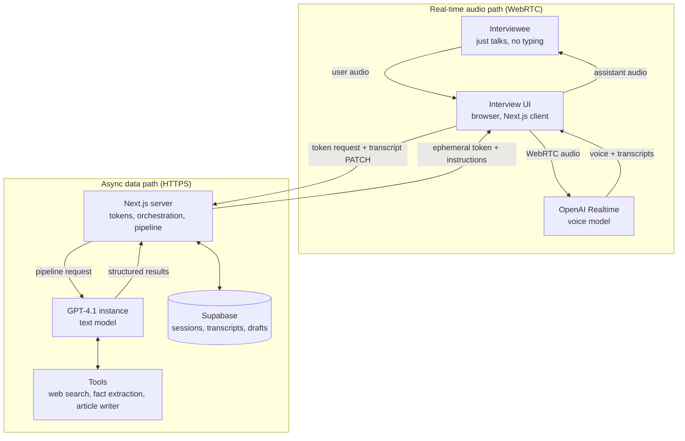

# Architecture

The kit is split into **two paths** that never block each other — the same idea behind modern realtime voice stacks: audio keeps flowing continuously while heavier reasoning and I/O happen asynchronously alongside it.

- **Real-time audio path (WebRTC).** The browser connects *directly* to the OpenAI Realtime API. The Next.js server is never in the audio path — it only mints an ephemeral token with the interview instructions baked in. If the tab dies mid-interview, everything already PATCH'd to the server is safe.
- **Async data path (HTTPS).** Token minting, transcript persistence, destination research, and the post-interview processing pipeline all run over plain HTTP against the Next.js server, which delegates text work to a GPT-4.1 model instance and stores results in Supabase.

The committed SVGs in this folder (`architecture-light.svg` / `architecture-dark.svg`) are the rendered versions of this graph. This Mermaid block is the **editable source of truth** — update it first, then regenerate the SVGs to match.



## Session lifecycle

```
intake → researching → ready → interviewing → processing → completed
                                                         ↘ failed
```

1. **Intake** — the subject fills the config-defined intake form; a session row is created.
2. **Research** *(optional, config-gated)* — GPT-4.1 with live web search builds an interview brief (topic hints, community questions, per-city tips). **Research blocks the interview start on purpose**: the "Start Interview" button stays disabled until the snapshot lands, so the interviewer has real context from question one instead of asking generic questions.
3. **Voice interview** — the browser fetches an ephemeral Realtime token from `/api/sessions/[id]/realtime`. The server bakes the full system prompt (persona + intake + research) into the token, then gets out of the way: audio flows browser ↔ OpenAI directly over WebRTC. Transcript entries are PATCH'd to the server as they arrive.
4. **Processing pipeline** — five steps, in order: clean transcript → extract structured facts (every fact must cite a verbatim interviewee quote — no hallucinated answers) → generate the article → build the publish payload → store versioned outputs.
5. **Review & publish** — the review UI shows the generated draft; the output payload is publish-ready JSON (WordPress-shaped by default).

## Design decisions worth knowing

| Decision | Why |
|---|---|
| Server never in the audio path | Latency + resilience: partial transcripts survive a dead tab, and the server can't bottleneck audio. |
| Research blocks interview start | An interviewer with a brief asks specific questions; one without produces generic content. |
| Input audio transcription explicitly enabled | Without `input_audio_transcription` in the Realtime session config, OpenAI never emits user-side transcripts — and downstream extraction hallucinates the missing answers. |
| Evidence-log extraction | Every extracted fact must quote the interviewee verbatim, so interviewer *questions* can't masquerade as facts. |
| Unknowns stay `null` | If budget (or anything else) wasn't discussed, it stays `null` and the article skips it — never estimated. |

## Configuration layer (partially wired)

[`interview.config.ts`](../interview.config.ts) is intended to hold everything domain-specific, so the engine can stay generic. That's the destination, not the current state.

**Read by the engine today:** the four prompt builders (research, interviewer persona, extraction, output), the Realtime model/voice/transcription settings, `research.enabled`, `intake.subjectNameField`, and `intake.repeatingSection`.

**Declared but not yet consumed:** `branding`, `subject.label` / `profileFields`, `intake.fields`, `intake.topicField`, `interview.phases`, `extraction.requireEvidenceLog`, `connectors`, `campaigns`. The UI hardcodes travel equivalents for these.

The genuinely domain-agnostic pieces to build on are the [`InterviewContext`](../src/lib/config/types.ts) contract and four engine files that already contain zero travel references: `extractor.ts`, `article-generator.ts`, `research-service.ts`, and the realtime token route. The wiring order is in the README roadmap.
